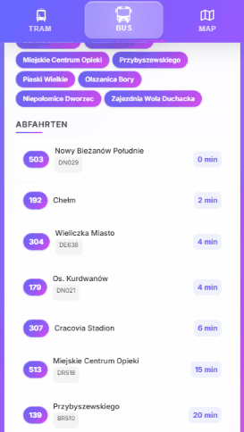
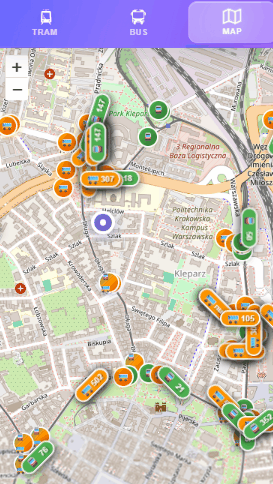

# ⚙️ Live Departures – Infrastructure

## 🌐 Live Demo

**Try the app: [https://live-departures.pages.dev/](https://live-departures.pages.dev/)**

  
  &nbsp;
  &nbsp;
  &nbsp;
  &nbsp;
  &nbsp;
  &nbsp;
  

* 🖼️ **Frontend (PWA):** [github.com/lukasznidecki/live-departures](https://github.com/lukasznidecki/live-departures)  
* 🧪 **Backend API:** [github.com/lukasznidecki/live-departures-backend](https://github.com/lukasznidecki/live-departures-backend)

📌 **This repository contains all infrastructure code** for deploying the PWA and its backend to a production-grade
Kubernetes environment using Terraform, Helm, ArgoCD, and Cloudflare.

**Supports both AWS (EKS) and GCP (GKE)** - configure via the `cloud_provider` variable.

---

## 📌 Overview

This repository contains the **infrastructure as code** for deploying the Live Departures PWA and its Backend API
to a production-grade Kubernetes environment.

It demonstrates:

- **Terraform** for provisioning cloud resources
- **Helm** for Kubernetes deployments
- **ArgoCD** for GitOps continuous delivery
- **OIDC Authentication via Dex**
- **Secrets management** via Google Secret Manager (GCP) or AWS Secrets Manager (AWS)
- **Monitoring & Logging** with Prometheus, Grafana, GCO
